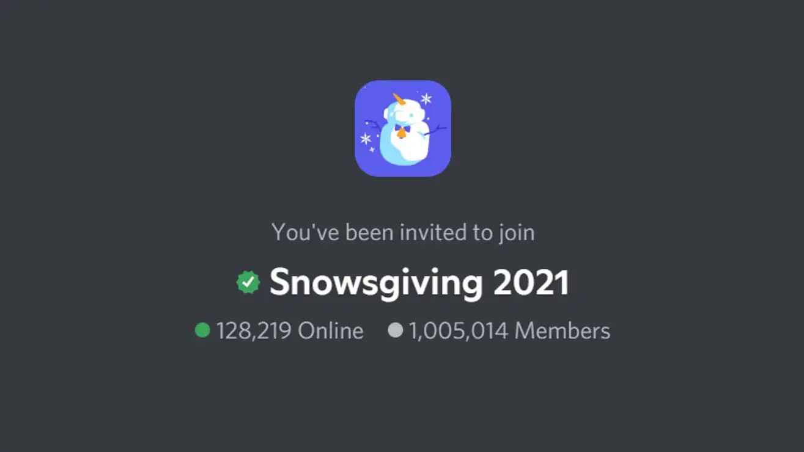
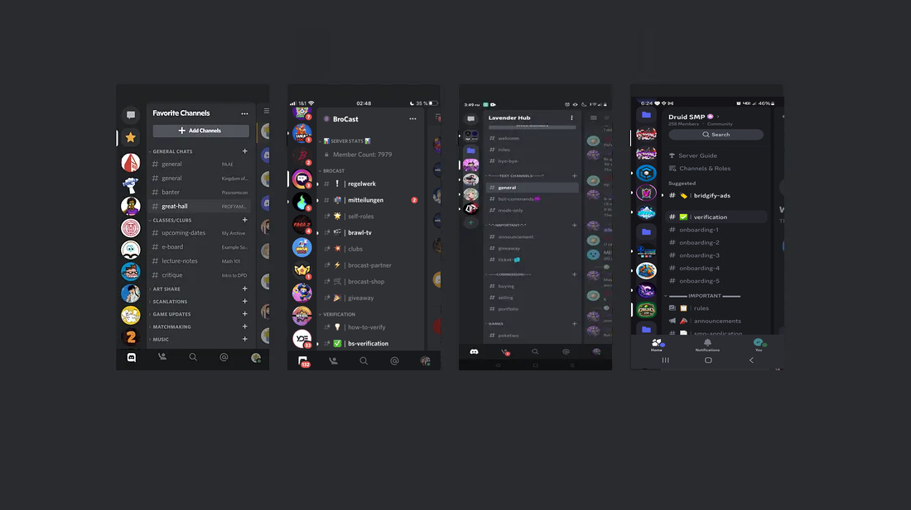
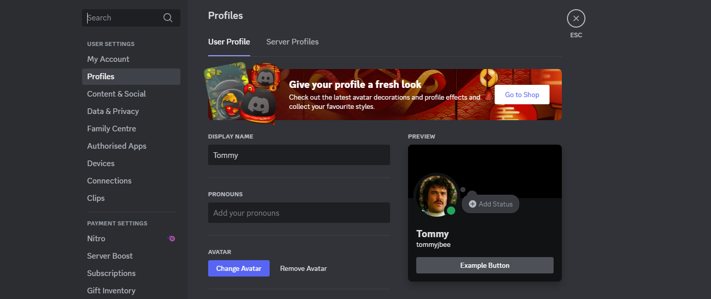
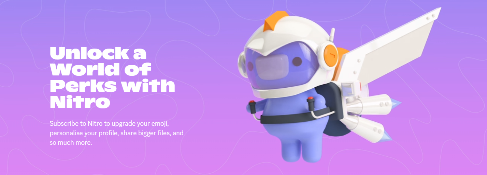

# What is Discord? **🧠**

[Discord](https://discord.com/) is a free app that allows users to instantly communicate with each other through text messaging 💬, voice calls 📞, video calls 📹, and media 📷. It's a social platform that's available on many devices and operating systems, including Windows, macOS, Linux, iOS, Android and in many web browsers 🌐. As of 2024, the service has about [150 million monthly active users](https://discord.com/company) of people ages 13+ to talk and hang out with their communities and friends. It’s primarily used by gamers 🎮, although the share of servers for other topics is growing. As of March 2024, Discord was the 30th most visited website in the world 🌎. 

# Discord’s Lingo **💬**

## Servers **🛠️**

Communication can be private, or take place in virtual communities called “servers”. They are made by specific communities and friend groups. Most of these servers are small and can people can only become members via invites. Some larger servers are public. Any person with a Discord account is able to create a server for free, start their own community, or their own friendship group. As of 2024, Discord has reported hosting around 19 million weekly active servers

They are called "guilds" in the developer documentation, to distinguish themselves from actual servers. Most servers have a limit of 250,000 members, but Discord can offer a server member cap increase if it meets certain criteria.

The previously largest known Discord server was Snowsgiving 2021, an official Discord-controlled server made for the 2021 winter holiday season, reaching 1 million members. However, in 2023 the server for Midjourney reached over 15 million members. Read about how Discord manage to push the limits here: https://discord.com/blog/maxjourney-pushing-discords-limits-with-a-million-plus-online-users-in-a-single-server

In October 2017, Discord started to allow game developers and publishers to verify their server (think similar to how you can get verified on twitter, or instagram). Verified servers, have badges to make them as official communities. In February 2018, verification was extended to include esports teams and musical artists. In 2023 Discord paused their verification program while they performed some maintenance and has not been reopened as of January 2025.

 ****

## Channels **📝**

Servers are made up of chat rooms and voice channels. Channels are usually dedicated to specific topics. Some channels can only be accessed by members with a certain permission that can be given to them by the server administrators. Channels can also be grouped into categories.

- **Text Channels 📝** - These are channels where people can post text messages, upload media such as images or files
- **Voice Channels 🎤** - These channels allow people to connect through voice or video. They also can be used to allow people to share their screen with others (called **Go-Live**📻)
- **DMs (Direct Messages) 💌** -  Like other social platform, Discord allows people to send private messages to other users, as well as voice and video calls. Most DMs are one-on-one, but Discord allow users to create Group DMs with a maximum of ten people. These Group DMs are not public and can only be accessed via an invitation from someone in the group

### Other Types of “Channels”

- **Threads** 🧠 - (introduced in 2021) which are temporary text channels that can be set to automatically disappear when they have been inactive for a specific length of time. This is meant to help foster more communication.

- **Forum Channels** - 📖 (introduced in 2022) to allow for longer and separate conversations, returning the Internet forum experience to Discord.

- **Media Channels** - 🎞️ (introduced in 2023), which restricted content to videos and images only.

## User Profiles **👤**

Users register for Discord with an email address and must create a username. Until mid-2023, multiple users could have the same username. This was possible as each user was assigned a four-digit number at the end of their username, prefixed with “#”. This was called a discriminator (or Discord tag). For example tomblackburn#0347. Usernames were also cAsE sEnSitIvE. 

However, this system changed and new, unique usernames and display names were added. New usernames are lowercase, alphanumeric, limited to certain special characters, and do not have discriminators, making them easier to remember, read, type, and share. 

Users selected their new usernames in priority based on how early they registered for Discord, Nitro status, and ownership of partner and verified servers. 

In 2021, Discord introduced a new feature to the platform that introduced an *about me* section to user profiles, as well allowing a custom colored banner to be included at the top of a user’s profile. Subscribers to Discord Nitro have the added ability to upload static or animated images as their *banners* instead of solid colors.

### Display Names **🌟**

A user’s display name is how they will primarily appear in a Discord server. The rules of display name differ from those enforced when creating a username, allowing special characters, spaces, and even emojis 🎉. I say primarily how a user will appear, because there are other factors which override the users selected display name. 

Friend nicknames can be set by other users on how they want to refer to you as. 

## [Nitro](https://discord.com/nitro) and Server Boosts **💨**

Nitro is Discord’s premium subscription service, offering special perks for subscribers, such as the ability to use custom emotes in every server, a higher file upload cap, discounted Server Boosts and custom profiles. It comes in two flavours, Nitro Basic and Nitro

This service was released in 2017 for a monthly subscription fee of $4.99. In 2018 this was later renamed to **Nitro Classic** and a new **Nitro** was introduced at a cost of $9.99 and included access to free games through the Discord game store. This free game service ended in 2019.

2019 also saw the introduction of **Server Boosts 🎉**. **Boosts** allow people to support their favourite servers, by unlocking perks for everyone in them. The more Boosts a server has, the more epic the perks that can be unlocked. Perks such as more emoji slots 💜, high quality audio and video streaming 💰, customer server banners and icons 🎨. At the final level, server’s can get their own Vanity URL 🛠️.