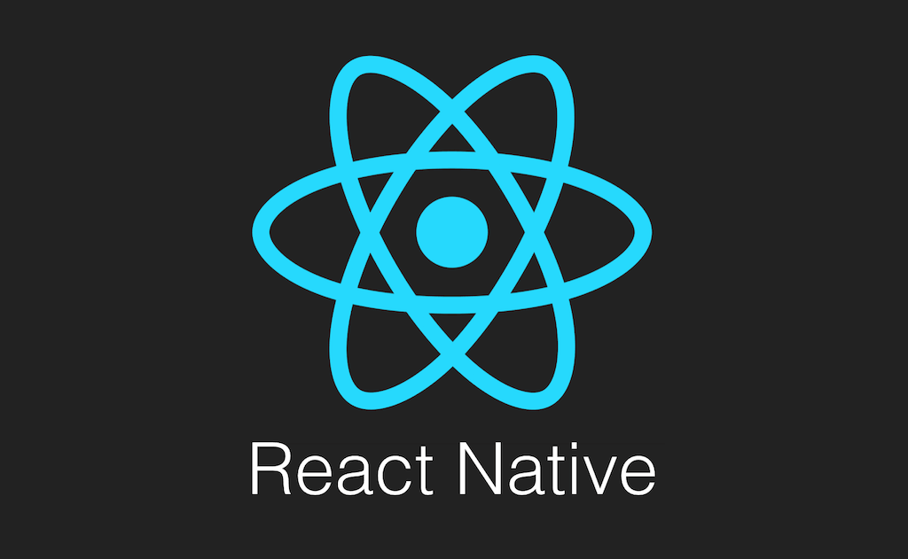
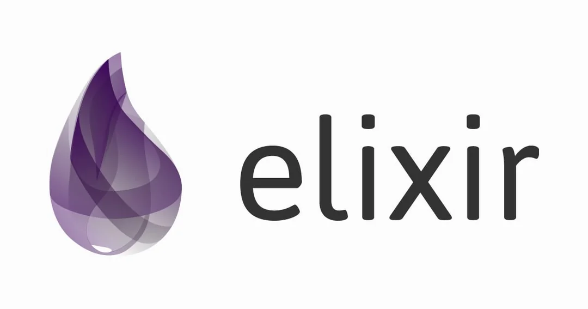
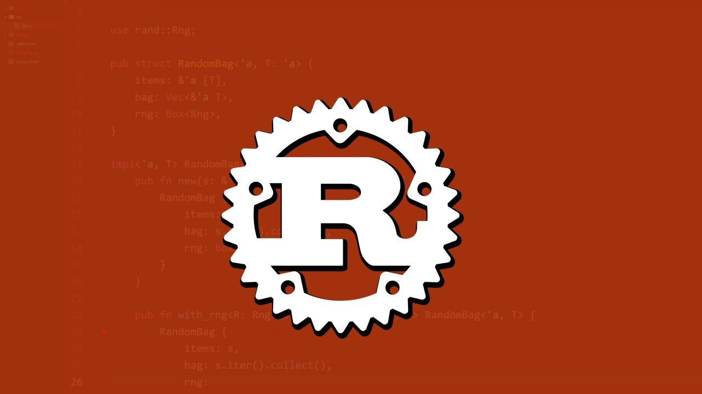

## The Discord Client

### React Native and Typescript **💪**

The Discord client is written in [TypeScript](https://www.typescriptlang.org/) with [React Native](https://reactnative.dev/), helping to drive iOS user adoption from zero to millions. React Native has also allowed the Discord team to quickly leverage reusable code across different platforms, as well as develop a cohesive team of designers and developers. 

🌟 They waited until the day that React Native was released until they started work on their iOS app.

Similarly, they also tried React Native for Android on the day it was released, which only took two days to build. However, they didn’t continue to choose React Native as their weapon of choice for Android due to issues such as poor performance of touch events and lack of 64-bit support.

🤔 This seems like an odd choice, considering that React Native’s message is all about “Learn once, write anywhere”. However, the Discord team would find other huge benefits for using React Native:

- 📚Their front-end technology stack consists of React and Flux, allowing them to leverage much of the business logic and a vast amount of their front-end tooling and infrastructure from web to iOS
- 💪Their React Native engineers didn’t need to be proficient in the Android platform and could instead focus on build and maintaining a quality iOS app

You can find out more about Why Discord choose and continuing to stay with React Native here: 🔗https://discord.com/blog/why-discord-is-sticking-with-react-native which they have 🔗[released as an open source library](https://github.com/discord/sorted_set_nif)

As of 2022, Discord were able to meet all the requirements to migrate their Android app over to React Native.

## The Discord Server **🌐**

The Discord Server is leverages a few different technologies, such as Elixir, Python, Rust and C++, all very powerful languages for building servers.

### Elixir, Python and C++ **🤖**

Elixir is a functional programming language built to run on the same virtual machine that powers Erlang, known as the BEAM. Elixir is lauded for its productivity and development in the domains of web development, embedded software, machine learning, data pipelines, and multimedia processing, just to name a few.  

💡Back in 2015, Discord chose two main languages to build their infrastructure: Elixir and Python.  Elixir was initially picked to power the WebSocket gateway, responsible for relaying messages and real-time replication, while Python powered their API.

💪Today, the Python API is a monolith. The Elixir stack contains over 20 or so different services. An impressive feat that Discord has managed is only needed five engineers to be responsible for the chat infrastructure. To power their chat messaging systems, Discord runs a cluster with 400-500 Elixir machines.

🎤Discord also uses Elixir as the control plane of their audio and video services, also known as signaling, which establishes communication between users.

C++ is responsible for media streaming, a combination that altogether runs on 1000+ nodes.

Read more about real-time communication at scale here: 🔗https://elixir-lang.org/blog/2020/10/08/real-time-communication-at-scale-with-elixir-at-discord/

### Rust (Previously Go) **🦜**

💡Discord has been fortunate enough to have “good problems” arise as people start to use Discord for large scale groups. As such the Backend Infrastructure team at Discord are often hard at work improving scalability and performance of their real-time communications infrastructure. 

Rust has becoming a first class language in a variety of domains. Discord use both Rust on the client side and server side. For the client side, they use Rust for their video encoding pipeline for Go Live and on the server side for **Elixir Native Implemented Functions (NIFs).** 

Read how Discord implemented Rust backed SortedSet that powers every single Discord guild here: 🔗https://web.archive.org/web/20200426164224/https://blog.discord.com/using-rust-to-scale-elixir-for-11-million-concurrent-users-c6f19fc029d3

🚫 Discord also migrated their “**Read States**” service from Go to Rust (Sorry Go enthusiasts). Its sole purpose is to keep track of which channels and messages you have read. The Go implementation saw intermittent large latency spikes, due to some core Go features, like its memory model and garbage collector (GC). Read more here: 🔗https://discord.com/blog/why-discord-is-switching-from-go-to-rust

## Database **📂**

### ScyllaDB (Previously Apache Cassandra, and MongoDB) **🏢**

When Discord was originally built in early 2015, one of the best databases for iterating quickly was MongoDB, but the developers strategically planned their designs for easy migration to new databases. They did this because they knew that sharding in MongoDB was extremely complicated to use and wasn’t known for its stability. 

💪 In under a year, when they reached over 100 million stored messages, they started to experience issues and they recognized that it was time to migrate to a database that would be more suited to the tasks.

[Apache Cassandra](https://cassandra.apache.org/_/index.html) backed by DataStax was their database of choice. A know technology being used in many large companies such as Netflix and Apple who have thousands of Cassandra nodes. It met all their requirements and was open source and community driven. Read more about their Cassandra decision here: 🔗https://discord.com/blog/how-discord-stores-billions-of-messages

In 2020, again pain points started their Cassandra cluster started to exhibit some serious performance issues that required an increasing amount of effort to just maintain. It had ballooned from 12 Cassandra nodes storing billions of messages to 177 nodes with trillions of messages.

ScyllaDB is a a Cassandra-compatible database written in C++. After experimenting with ScyllaDB and observing improvements in testing, the Discord team made the decision to migrate all their databases. 

As part of the migration, Rust came in to save the day. The data services that sit between the API and theScyllaDB clusters were written in Rust, making it easy to write safe concurrent code.

🚀 It now is a much more efficient database — going from running 177 Cassandra nodes to just 72 ScyllaDB nodes. Each ScyllaDB node has 9 TB of disk space, up from the average of 4 TB per Cassandra node.

Read more here: 🔗 https://discord.com/blog/how-discord-stores-trillions-of-messages